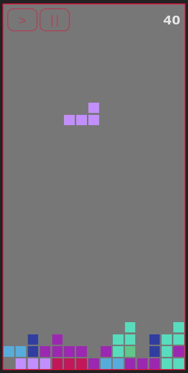

# tetris-game
Tetris feito em typescript

<a href="https://sweet-pegasus-9e59f0.netlify.app" target="_blank"><h2>link para Jogar</h2></a>

## ScreenShot

## Requisitos
* NodeJs

## Iniciar 
* Rode yarn ou npm install no terminal para instalar dependencias.
* Rode yarn build && yarn preview ou npm run build && npm preview.
* Para rodar em modo desenvolvimento yarn dev ou npm run dev.

> Controles:
  * Barra de espaço para rotacionar.
  * Setas (direita e esquerda) para mover.
  * Seta para baixo para cair mais rapido.
